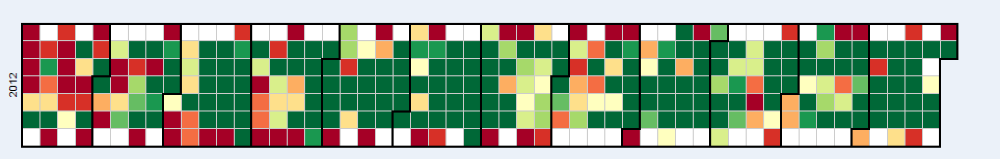

RMVPP User Guide
===

# Introduction

The Rittman Mead Visual Plugin Pack (RMVPP) is an application plugin intended to simplify, the process of using custom visualisations and open them up to configuration by advanced users.

After a quick installation procedure, the RMVPP can allow users to create visualisations that are not found in OBIEE, using external Javascript libraries, particularly [D3](http://d3js.org/). This is the modern standard for web data visaualisation. It is extremely powerful and is becoming widely used. There are many other charting frameworks out there built on D3 and RMVPP should help those to be easily integrated as well. There is no reliance on Flash or Java, all visualisations are in HTML5 only.

It is integrated with OBIEE, so the criteria tab is maintained and new view options are available. This is useful as it doesn't require a totally new interface to work with OBIEE, but can be limiting to developers as visualisations have to run within the OBIEE frames and HTML. The integration itself is purely client side in Javascript.

# Navigating the Interface

To be able to use the RMVPP, you must first navigate to an Analysis, so log into OBIEE and create a new analysis (or open an existing one), in the Subject Area of your choice. Navigate to the "Criteria" tab, and add some Dimensions and Measures. 
For this example, I am using a Dimension called "Opportunity Close Date" and a Measure titled "Opportunity Amount". The image below shows my criteria:

You may use other criteria of course, but for now, this guide will only use the above. Click the "Results" tab at the top of the Analysis, and you will be able to view the "Compound Layout". By default, a Table and a Title exists already on the page.

The Rittman Mead icon at furthest right of the ribbon (highlighted in red in the above screenshot) is the icon to insert an RMVPP visualisation. Click this icon, and you will be taken to the RMVPP home page, similar to the screenshot below:

Click the dropdown box to view the plugins, or visualisations, you have available. Since the example Dimensions and Measures are working with dates, I will select the "Calendar" visualisation. 

Select a plugin by clicking it from the dropdown list. After selecting a plugin, the screen will update automatically to display the default configurations of the selected plugin, as well as a default visualisation, if possible, below.

In the above image, we see two bolded sections, "Column Mappings" and "Configuration". The "Column Mappings" section describes which criteria you want to be mapped to what input values. In this example, we have two input values, "Date" and "Metric". These two values should match their respective criteria. 
The other section  is the "Configuration" section. Each plugin has configurations that either describe to the plugin how to handle the incoming data, or allow the accompanying visualisation to be customized. The Calendar visualisation has several configurable fields, Value Upper Limit, Value Lower Limit, Date format, and Year(s). 

# Making a Visualisation

Continuing from the above example, we should now know the basic components each plugin requires in order to render correctly. In this section, we will enter in some of the basic values to have our Calendar render properly.

Notice the "Date" value is paired with the "OPPORTUNITY_CLOSE_DATE" criteria, and the "Metric" value is paired with the "OPPORTUNITY_AMOUNT" criteria. Since we only have two criteria, the plugin is able to correctly select the criteria to be matched into each parameter. However, if we had several criteria, it would be likely we would have to manipulate the dropdown lists to select the correct, desired criteria.

When building visualisations, play especially close attention to mapping the criteria to the input values. If the criteria does not make sense as its accompanying input value, the visualisation will not work at all. Since the "Column Mappings" section is already correct, we will not edit it, so we can move on to the "Configuration" section.
By looking at the table OBIEE made for us, we see most of the values for OPPORTUNITY_AMOUNT reside somewhere between the 40,000 and 500,000 range. Based on this, we are going to set our "Value Upper Limit" to 500,000, as the desired goal of this metric, and 40,000 as the value for the "Value Lower Limit" metric. 

We also have a Date format field, with some weird looking syntax. This string is the data the visualisation needs in order to make sense of the Dates coming in. The syntax follows the D3 standard syntax, which can be found at the bottom of this document. All visualisations that use a Date Format use the standard D3 syntax. 
As we see in the table, again, dates are coming in formatted as "01/11/2012", so Month/Day/Year, with months and days having 0 padding and the year being four digits. So for our Date Format field, we are going to enter "%m/%d/%Y", the D3 date syntax that corresponds to the dates coming in. 

We then select a year we want to be looking at (let's try 2012), and finally click "Apply" at the bottom. The final configuration parameters are shown below:

The new visualisation will appear BELOW the configuration settings, so you may need to scroll down to see it. Below is how the example visualisation rendered:

We can see the visualisation rendered correctly, with each date in the result set being represented by its accompanying value. You can now click "Save", "Done", and place the analysis on any dashboard you wish. 

